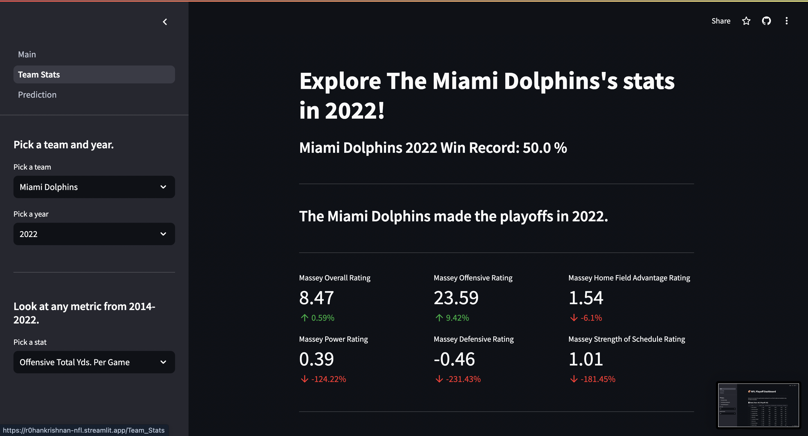
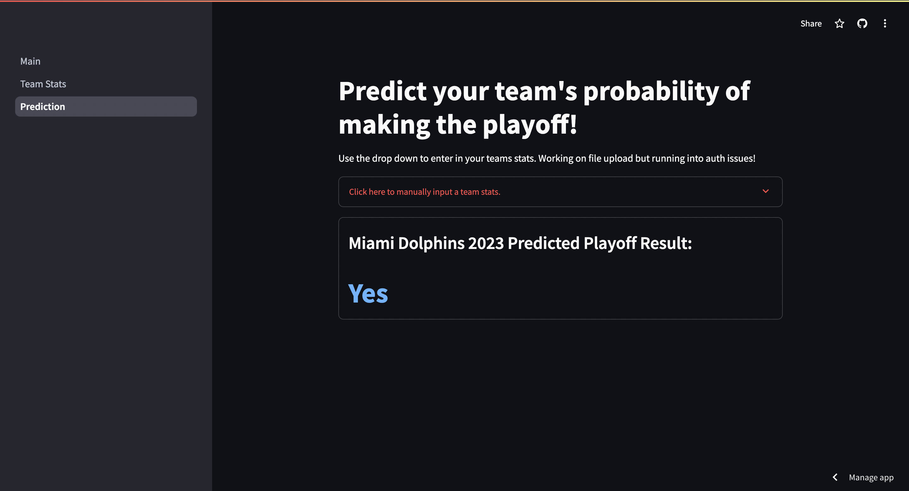

# NFL Playoff Prediction Project (In Progress)
**If you are visiting from my CV, you can go to the `class-work` folder to see my original code and writing submissions**

Using self-gathered data, I will explore various methods of predicting what NFL teams will make the playoffs using python. This project was originally done in Spyder but is being recreated and expanded upon using VSCode for learning purposes.

## Table of Contents
1. [Introduction](#Introduction)
   - [Background](#Background)
3. [Data](#Data)
3. [Exploratory Analysis](#Exploratory-Analysis)
4. [Modeling](#Modeling)
5. [Dashboarding](#Dashboarding)

## Introduction
For this project, I am acting as a data analyst for a large sports betting company responsible for producing predictions regarding which NFL teams are most likely to make the playoffs this (2023) season. Highly accurate predictions will allow the company to offer bets with odds that most favor the company themselves. 

### Background
According to the American Gaming Association (AGA), sportsbook revenue hit $7.5 billion USD in 2022. The total addressable US betting market is estimated to be worth more than $40 billion USD by 2030, according to Flutter. To best capitalize on this growing market, our company must be able to consistently offer favorable bets. To help human analysts, I will design a model to classify teams into either “making the playoffs” or “not making the playoffs” to leverage the large amount of statistical data available on the NFL. This model, combined with the expert opinion of the company’s analysts may prove useful when trying to offer more favorable bets. 

## Data
For this project, I decided to source my own data. I started with [ESPN’s NFL statistics](https://www.espn.com/nfl/stats/team). The ESPN data consisted of offensive, defensive, special team, and turnover statistics for each of the 32 teams in the NFL. Their data ran back to 2014 and showed which teams made the playoffs each year. 

In addition to the NFL statistics, I wanted to include expert opinions as variables to capture their sentiment in my models. To do this, I used the [Massey ratings](https://masseyratings.com/). The Massey ratings are an open-source computer rating of all 32 teams in the NFL. They are rated on a variety of statistics including power, defense, record, etc. The rating system has been in use (with regular improvements and updates) since August 1999 and uses regression and Bayesian inference to derive its statistics. Overall, the Massey rating system proved a useful input to represent an expert’s opinion on each team’s season performance. 

To create the dataset, I copied each team’s performance across all the above measures into an excel document for the years 2014-2022 (2023 was made separately). I first copied each section (four ESPN sections and one Massey rating section) into separate sheets. Then, I used INDEX(MATCH()) to combine all five sheets into one final dataset. 

I repeated this process separately for the 2023 data, which is what I ultimately will be predicting over. 
 
## Exploratory Analysis

## Modeling
|Model|Accuracy|
|-----|--------|
|Logistic Regression|59%|
|Decision Tree|84%|
|Decision Tree (ccp optimized)|84.38%|
|Random Forest|70%|
|Random Forest (random CV grid search optimized)|78%|

I elected to not try KNN due to the high dimensionality of the data, which had 33 features after cleaning. The logistic regression ok; however, many of the variables were not normally distributed, meaning the model's inferential power is severely diminished. This data, being high dimensional and varied, was a great fit for a tree-based model. The pruned classification tree was able to pick out the most important features including the Massey record statistic, the Massey power statistic, and total defensive yards per game, which all had some of the strongest correlations with making the playoffs. The random forest performed worse than the individual pruned decision tree. This seems to be because of training set overfitting. The data itself is relatively stable, meaning that our decision tree should suffer too much with variance issues. Rather than continue to hyper-optimize the random forest to surpass 84% accuracy, I decided to simply use the decision tree because it is highly explainable and does a very good job at prediction with little training time. 

## Dashboarding
A key goal of this project was to learn the python web-app framework, streamlit, and implement a dashboard using my nfl data and models. Using the [streamlit documentation](https://docs.streamlit.io/), I created a web app to summarize the nfl data I collected and to use the decision tree model to predict whether a team will make the playoffs. You can view the full dashboard [here](https://r0hankrishnan-nfl.streamlit.app) or by clicking on the link in the details of this repository.

